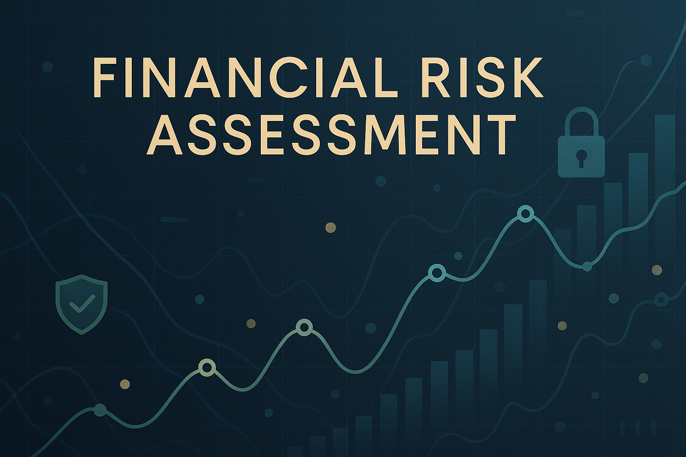

# Financial Risk Assessment



## English

### Overview
This repository presents a comprehensive solution for **Financial Risk Assessment** using Machine Learning. It provides tools and methodologies to evaluate and predict financial risk, helping institutions and individuals make informed decisions. The project focuses on data loading, preprocessing, model training (Random Forest Classifier), and evaluation.

### Features
- **Data Loading**: Efficiently loads financial data from CSV files.
- **Data Preprocessing**: Handles missing values and converts categorical features using one-hot encoding.
- **Machine Learning Model**: Implements a Random Forest Classifier for robust risk prediction.
- **Model Evaluation**: Provides accuracy and a detailed classification report.
- **Modular Design**: Code is structured into a Python class for reusability and clarity.
- **Unit Tests**: Comprehensive tests ensure the reliability and correctness of the implemented functionalities.

### Installation
To set up the project locally, follow these steps:

1.  **Clone the repository**:
    ```bash
    git clone https://github.com/galafis/Financial-Risk-Assessment.git
    cd Financial-Risk-Assessment
    ```

2.  **Create a virtual environment** (recommended):
    ```bash
    python3 -m venv venv
    source venv/bin/activate  # On Windows, use `venv\Scripts\activate`
    ```

3.  **Install dependencies**:
    ```bash
    pip install -r requirements.txt
    ```

### Usage
To run the financial risk assessment:

1.  **Prepare your data**: Ensure you have a CSV file with financial data. A sample `financial_data.csv` is generated if not present.

2.  **Execute the main script**:
    ```bash
    python src/main.py
    ```
    The script will load the data, preprocess it, train a Random Forest model, and print the evaluation metrics.

### Project Structure
```
Financial-Risk-Assessment/
├── src/
│   ├── __init__.py
│   └── main.py             # Main script for financial risk assessment
├── tests/
│   ├── __init__.py
│   └── test_main.py        # Unit tests for the project
├── docs/
│   └── README.md           # This documentation file
│   └── images/             # Directory for images (e.g., hero image)
├── requirements.txt        # Python dependencies
├── .gitignore              # Specifies intentionally untracked files to ignore
└── README.md               # Project README (this file)
```

### Running Tests
To run the unit tests, navigate to the project root and execute:

```bash
pytest tests/test_main.py
```

### License
This project is licensed under the MIT License - see the [LICENSE](LICENSE) file for details.

### Author
**Gabriel Demetrios Lafis**

---

## Português

### Visão Geral
Este repositório apresenta uma solução abrangente para **Avaliação de Risco Financeiro** utilizando Machine Learning. Ele fornece ferramentas e metodologias para avaliar e prever o risco financeiro, ajudando instituições e indivíduos a tomar decisões informadas. O projeto foca no carregamento de dados, pré-processamento, treinamento de modelo (Random Forest Classifier) e avaliação.

### Funcionalidades
- **Carregamento de Dados**: Carrega eficientemente dados financeiros de arquivos CSV.
- **Pré-processamento de Dados**: Lida com valores ausentes e converte características categóricas usando one-hot encoding.
- **Modelo de Machine Learning**: Implementa um Random Forest Classifier para uma previsão de risco robusta.
- **Avaliação do Modelo**: Fornece acurácia e um relatório de classificação detalhado.
- **Design Modular**: O código é estruturado em uma classe Python para reusabilidade e clareza.
- **Testes Unitários**: Testes abrangentes garantem a confiabilidade e correção das funcionalidades implementadas.

### Instalação
Para configurar o projeto localmente, siga estes passos:

1.  **Clone o repositório**:
    ```bash
    git clone https://github.com/galafis/Financial-Risk-Assessment.git
    cd Financial-Risk-Assessment
    ```

2.  **Crie um ambiente virtual** (recomendado):
    ```bash
    python3 -m venv venv
    source venv/bin/activate  # No Windows, use `venv\Scripts\activate`
    ```

3.  **Instale as dependências**:
    ```bash
    pip install -r requirements.txt
    ```

### Uso
Para executar a avaliação de risco financeiro:

1.  **Prepare seus dados**: Certifique-se de ter um arquivo CSV com dados financeiros. Um `financial_data.csv` de exemplo é gerado se não estiver presente.

2.  **Execute o script principal**:
    ```bash
    python src/main.py
    ```
    O script carregará os dados, os pré-processará, treinará um modelo Random Forest e imprimirá as métricas de avaliação.

### Estrutura do Projeto
```
Financial-Risk-Assessment/
├── src/
│   ├── __init__.py
│   └── main.py             # Script principal para avaliação de risco financeiro
├── tests/
│   ├── __init__.py
│   └── test_main.py        # Testes unitários para o projeto
├── docs/
│   └── README.md           # Este arquivo de documentação
│   └── images/             # Diretório para imagens (ex: imagem hero)
├── requirements.txt        # Dependências Python
├── .gitignore              # Especifica arquivos intencionalmente não rastreados a serem ignorados
└── README.md               # README do Projeto (este arquivo)
```

### Executando Testes
Para executar os testes unitários, navegue até a raiz do projeto e execute:

```bash
pytest tests/test_main.py
```

### Licença
Este projeto está licenciado sob a Licença MIT - veja o arquivo [LICENSE](LICENSE) para detalhes.

### Autor
**Gabriel Demetrios Lafis**

