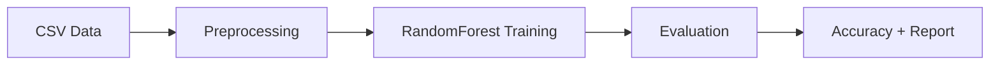

# Financial Risk Assessment

[](https://www.python.org/)
[](https://scikit-learn.org/)
[](https://pandas.pydata.org/)
[](LICENSE)

[Portugues](#portugues) | [English](#english)

---

## Portugues

### Visao Geral

Ferramenta de classificacao de risco financeiro usando Python e scikit-learn. Um unico script (`src/main.py`, 168 linhas) que carrega dados financeiros de um CSV, pre-processa as features, treina um RandomForestClassifier para prever niveis de risco (baixo, medio, alto) e gera metricas de avaliacao.

### Funcionalidades

- Carregamento de dados a partir de arquivo CSV (ou geracao de dados de exemplo)
- Pre-processamento: preenchimento de valores ausentes (media para numericos, moda para categoricos) e one-hot encoding
- Treinamento de modelo RandomForestClassifier
- Avaliacao com acuracia e relatorio de classificacao
- Testes unitarios com pytest

### Arquitetura


### Como Usar

#### Pre-requisitos

- Python 3.12+
- pip

#### Instalacao

```bash
git clone https://github.com/galafis/Financial-Risk-Assessment.git
cd Financial-Risk-Assessment
python -m venv venv
source venv/bin/activate  # Windows: venv\Scripts\activate
pip install -r requirements.txt
```

#### Execucao

```bash
python src/main.py
```

O script gera um CSV de exemplo (`financial_data.csv`), treina o modelo e exibe a acuracia e o relatorio de classificacao no terminal.

#### Testes

```bash
pytest tests/
```

### Estrutura do Projeto

```
Financial-Risk-Assessment/
├── src/
│   ├── __init__.py
│   └── main.py          # Script principal (168 linhas)
├── tests/
│   └── test_main.py     # Testes unitarios
├── .gitignore
├── LICENSE
├── README.md
└── requirements.txt
```

### Stack

| Tecnologia | Uso |
|---|---|
| Python | Linguagem principal |
| pandas | Manipulacao de dados |
| scikit-learn | Treinamento e avaliacao do modelo |
| pytest | Testes unitarios |

### Licenca

Este projeto esta licenciado sob a Licenca MIT - veja o arquivo [LICENSE](LICENSE) para detalhes.

### Autor

**Gabriel Demetrios Lafis**
- GitHub: [@galafis](https://github.com/galafis)
- LinkedIn: [Gabriel Demetrios Lafis](https://linkedin.com/in/gabriel-demetrios-lafis)

---

## English

### Overview

Financial risk classification tool using Python and scikit-learn. A single script (`src/main.py`, 168 lines) that loads financial data from a CSV, preprocesses features, trains a RandomForestClassifier to predict risk levels (low, medium, high), and outputs evaluation metrics.

### Features

- Load data from CSV file (or generate sample data)
- Preprocessing: fill missing values (mean for numeric, mode for categorical) and one-hot encoding
- Train a RandomForestClassifier model
- Evaluate with accuracy score and classification report
- Unit tests with pytest

### Architecture



### Usage

#### Prerequisites

- Python 3.12+
- pip

#### Installation

```bash
git clone https://github.com/galafis/Financial-Risk-Assessment.git
cd Financial-Risk-Assessment
python -m venv venv
source venv/bin/activate  # Windows: venv\Scripts\activate
pip install -r requirements.txt
```

#### Run

```bash
python src/main.py
```

The script generates a sample CSV (`financial_data.csv`), trains the model, and prints accuracy and classification report to the terminal.

#### Tests

```bash
pytest tests/
```

### Project Structure

```
Financial-Risk-Assessment/
├── src/
│   ├── __init__.py
│   └── main.py          # Main script (168 lines)
├── tests/
│   └── test_main.py     # Unit tests
├── .gitignore
├── LICENSE
├── README.md
└── requirements.txt
```

### Stack

| Technology | Usage |
|---|---|
| Python | Core language |
| pandas | Data manipulation |
| scikit-learn | Model training and evaluation |
| pytest | Unit tests |

### License

This project is licensed under the MIT License - see the [LICENSE](LICENSE) file for details.

### Author

**Gabriel Demetrios Lafis**
- GitHub: [@galafis](https://github.com/galafis)
- LinkedIn: [Gabriel Demetrios Lafis](https://linkedin.com/in/gabriel-demetrios-lafis)
